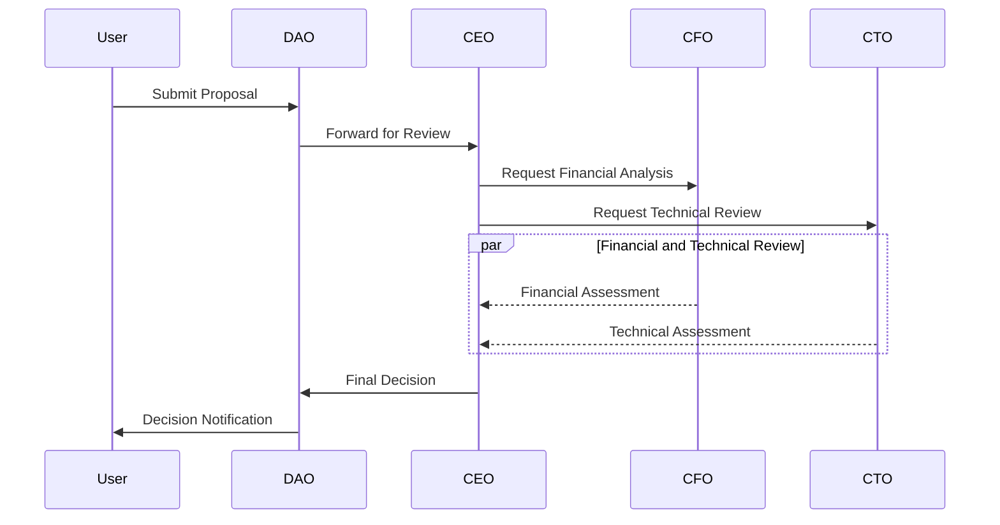

# Agent System Evolution

This document tracks the evolution of our AI agent system, focusing on the core three-agent architecture.

## Current Architecture

### Core Agents

1. CEO Agent
   - Strategic decision making
   - Proposal evaluation
   - Final approval authority
   - Coordination of other agents

2. CFO Agent
   - Treasury management
   - Financial analysis
   - Budget allocation
   - Risk assessment

3. CTO Agent
   - Technical evaluation
   - Infrastructure oversight
   - Security monitoring
   - Performance optimization

## Decision Pipeline

```typescript
interface Decision {
  id: string;
  type: DecisionType;
  initiator: AgentId;
  status: DecisionStatus;
  context: {
    priority: Priority;
    deadline: number;
    requirements: string[];
  };
  evaluations: {
    technical?: CTOEvaluation;
    financial?: CFOEvaluation;
    strategic?: CEOEvaluation;
  };
  outcome?: {
    approved: boolean;
    rationale: string;
    conditions?: string[];
  };
}

enum DecisionType {
  PROPOSAL_REVIEW = 'PROPOSAL_REVIEW',
  TREASURY_ACTION = 'TREASURY_ACTION',
  EMERGENCY_ACTION = 'EMERGENCY_ACTION',
  STRATEGIC_PLANNING = 'STRATEGIC_PLANNING'
}

enum DecisionStatus {
  INITIATED = 'INITIATED',
  UNDER_REVIEW = 'UNDER_REVIEW',
  PENDING_APPROVAL = 'PENDING_APPROVAL',
  APPROVED = 'APPROVED',
  REJECTED = 'REJECTED',
  EXECUTED = 'EXECUTED'
}
```

## Agent Communication

### Message Protocol
```typescript
interface AgentMessage {
  id: string;
  sender: AgentId;
  recipient: AgentId;
  type: MessageType;
  priority: Priority;
  payload: {
    action: string;
    parameters: Record<string, any>;
    context?: Record<string, any>;
  };
  metadata: {
    timestamp: number;
    correlationId?: string;
    threadId?: string;
  };
}

enum MessageType {
  REQUEST = 'REQUEST',
  RESPONSE = 'RESPONSE',
  NOTIFICATION = 'NOTIFICATION',
  ALERT = 'ALERT'
}

enum Priority {
  LOW = 'LOW',
  MEDIUM = 'MEDIUM',
  HIGH = 'HIGH',
  CRITICAL = 'CRITICAL'
}
```

## Integration Pattern



## Decision Making Process

1. Initial Evaluation
   ```typescript
   async function evaluateProposal(proposal: Proposal): Promise<Decision> {
     const decision = new Decision(proposal);
     
     // Parallel evaluations
     const [financialEval, technicalEval] = await Promise.all([
       CFO.evaluate(proposal),
       CTO.evaluate(proposal)
     ]);
     
     decision.addEvaluation('financial', financialEval);
     decision.addEvaluation('technical', technicalEval);
     
     return decision;
   }
   ```

2. Consensus Building
   ```typescript
   async function buildConsensus(decision: Decision): Promise<Decision> {
     const consensus = await CEO.analyzeEvaluations(decision);
     
     if (consensus.requiresDiscussion) {
       await initiateAgentDiscussion(decision);
     }
     
     return consensus;
   }
   ```

3. Final Decision
   ```typescript
   async function makeFinalDecision(decision: Decision): Promise<Outcome> {
     const outcome = await CEO.makeDecision(decision);
     
     if (outcome.approved) {
       await executeDecision(decision);
     }
     
     return outcome;
   }
   ```

## Security and Monitoring

1. Access Control
   ```typescript
   interface AgentPermissions {
     role: AgentRole;
     allowedActions: string[];
     restrictions: string[];
     auditLevel: AuditLevel;
   }
   ```

2. Action Validation
   ```typescript
   async function validateAction(
     agent: Agent,
     action: Action
   ): Promise<ValidationResult> {
     // Check permissions
     const permitted = await checkPermissions(agent, action);
     
     // Validate parameters
     const paramsValid = validateParameters(action);
     
     // Check rate limits
     const withinLimits = checkRateLimits(agent, action);
     
     return {
       valid: permitted && paramsValid && withinLimits,
       reasons: []
     };
   }
   ```

3. Audit Trail
   ```typescript
   interface AuditEntry {
     timestamp: number;
     agent: AgentId;
     action: string;
     context: Record<string, any>;
     outcome: string;
     metadata: {
       correlationId: string;
       decisionId?: string;
       systemState: Record<string, any>;
     };
   }
   ```

## Performance Metrics

1. Response Time
   ```typescript
   interface AgentMetrics {
     averageResponseTime: number;
     decisionAccuracy: number;
     consensusRate: number;
     utilizationRate: number;
   }
   ```

2. Success Rate
   ```typescript
   interface SuccessMetrics {
     proposalsEvaluated: number;
     decisionsApproved: number;
     decisionExecuted: number;
     consensusAchieved: number;
   }
