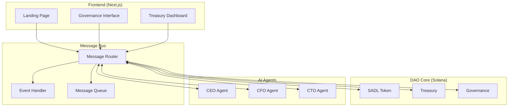
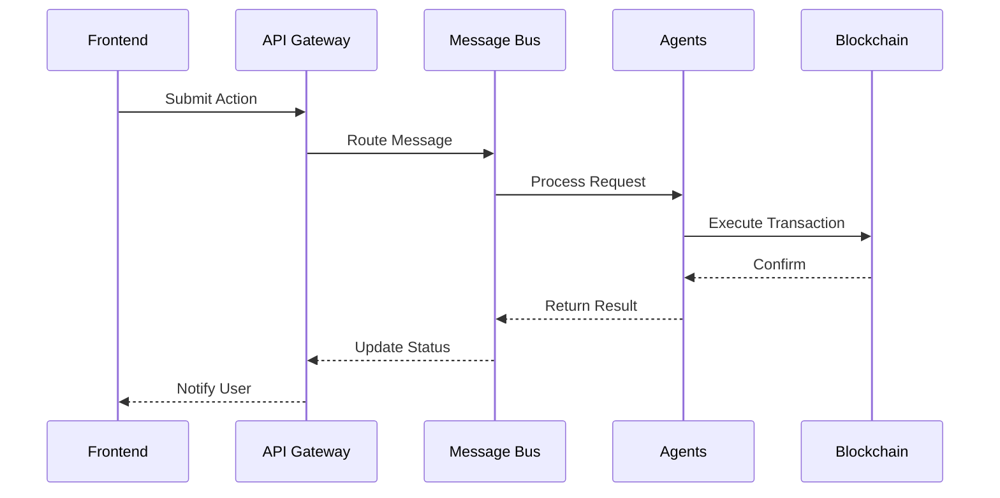

# Technical Specifications

This document contains technical specifications, diagrams, and architectural details for the current implementation.

## System Architecture



## API Specifications

### Base URL
```
https://api.sadellari.com/v1
```

### Authentication
All endpoints require JWT authentication with Solana wallet signature.

### Endpoints

#### Governance
```typescript
// Submit Proposal
POST /governance/proposals
{
  title: string
  description: string
  type: ProposalType
  parameters: ProposalParameters
}

// Get Proposal Status
GET /governance/proposals/{id}

// Vote on Proposal
POST /governance/proposals/{id}/vote
{
  support: boolean
  weight: number
}
```

#### Treasury
```typescript
// Get Treasury Status
GET /treasury/status

// Submit Transaction
POST /treasury/transactions
{
  amount: number
  recipient: string
  purpose: string
}

// Get Transaction History
GET /treasury/transactions
```

#### AI Agents
```typescript
// Get Agent Decision
POST /agents/{agentId}/decisions
{
  context: DecisionContext
  parameters: DecisionParameters
}

// Get Agent Status
GET /agents/{agentId}/status

// Send Agent Message
POST /agents/{agentId}/messages
{
  content: string
  priority: Priority
}
```

## Communication Protocols

### Message Types
```typescript
interface Message {
  id: string
  type: MessageType
  sender: string
  recipient: string
  payload: any
  metadata: {
    timestamp: number
    priority: Priority
    correlationId?: string
  }
}

enum MessageType {
  PROPOSAL = 'PROPOSAL',
  DECISION = 'DECISION',
  VOTE = 'VOTE',
  TRANSACTION = 'TRANSACTION',
  NOTIFICATION = 'NOTIFICATION'
}

enum Priority {
  LOW = 'LOW',
  MEDIUM = 'MEDIUM',
  HIGH = 'HIGH',
  CRITICAL = 'CRITICAL'
}
```

### Message Flow


## Security Model

### Authentication
```typescript
interface AuthContext {
  wallet: string
  signature: string
  timestamp: number
  nonce: string
}

interface Session {
  token: string
  expiresAt: number
  permissions: string[]
}
```

### Authorization
```typescript
interface Permission {
  resource: string
  action: string
  conditions?: Record<string, any>
}

interface Role {
  name: string
  permissions: Permission[]
  metadata: {
    description: string
    createdAt: number
    updatedAt: number
  }
}
```

### Audit Logging
```typescript
interface AuditLog {
  id: string
  timestamp: number
  actor: string
  action: string
  resource: string
  status: string
  metadata: {
    ip: string
    userAgent: string
    changes: Record<string, any>
  }
}
```

## Data Models

### Proposal
```typescript
interface Proposal {
  id: string
  title: string
  description: string
  type: ProposalType
  status: ProposalStatus
  creator: string
  createdAt: number
  votes: {
    for: number
    against: number
    abstain: number
  }
  decisions: Decision[]
  metadata: Record<string, any>
}
```

### Transaction
```typescript
interface Transaction {
  id: string
  type: TransactionType
  amount: number
  sender: string
  recipient: string
  status: TransactionStatus
  signature: string
  timestamp: number
  metadata: {
    purpose: string
    notes: string
    approvals: Approval[]
  }
}
```

### Decision
```typescript
interface Decision {
  id: string
  proposalId: string
  agent: string
  type: DecisionType
  outcome: DecisionOutcome
  rationale: string
  timestamp: number
  metadata: {
    confidence: number
    factors: string[]
    alternatives: Alternative[]
  }
}
```

## Error Handling

### Error Types
```typescript
interface ApiError {
  code: string
  message: string
  details?: Record<string, any>
  timestamp: number
  requestId: string
}

enum ErrorCode {
  UNAUTHORIZED = 'UNAUTHORIZED',
  FORBIDDEN = 'FORBIDDEN',
  NOT_FOUND = 'NOT_FOUND',
  VALIDATION_ERROR = 'VALIDATION_ERROR',
  BLOCKCHAIN_ERROR = 'BLOCKCHAIN_ERROR',
  AGENT_ERROR = 'AGENT_ERROR'
}
```

### Error Responses
```typescript
interface ErrorResponse {
  status: number
  error: ApiError
  path: string
  timestamp: number
}
```

## Monitoring & Metrics

### System Metrics
```typescript
interface SystemMetrics {
  performance: {
    responseTime: number
    throughput: number
    errorRate: number
  }
  resources: {
    cpuUsage: number
    memoryUsage: number
    networkIO: number
  }
  blockchain: {
    blockHeight: number
    tps: number
    fees: number
  }
}
```

### Agent Metrics
```typescript
interface AgentMetrics {
  decisions: {
    total: number
    approved: number
    rejected: number
    pending: number
  }
  performance: {
    averageResponseTime: number
    accuracyRate: number
    consensusRate: number
  }
  resources: {
    cpuUsage: number
    memoryUsage: number
    apiCalls: number
  }
}
