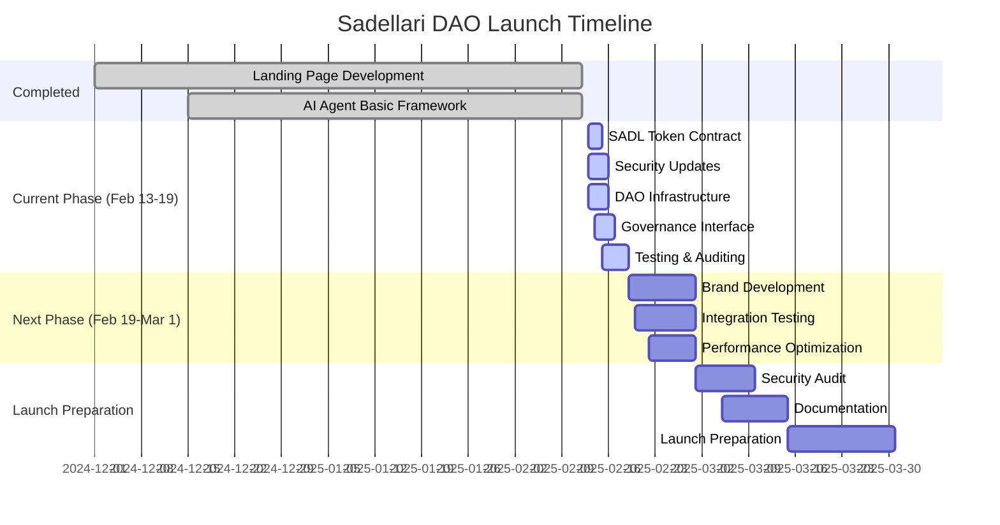

# Project Management

This document tracks project progress, milestones, and future plans.

## Current Status (February 13, 2025)

### Completed Components
- Landing page development
- AI agent basic framework
- Initial smart contract designs
- Core architecture setup
- Message bus implementation

### In Progress
1. Smart Contracts (85% complete)
   - SADL token contract
   - Governance contract
   - Treasury contract
   - Security updates from audit
   - Testing and auditing

2. DAO Infrastructure (75% complete)
   - Core functionality
   - Agent integration
   - Security features
   - Performance optimization

3. Frontend Development (60% complete)
   - Governance interface
   - Treasury dashboard
   - Wallet integration
   - Agent interaction UI

## Timeline

## Current Sprint (Feb 13-19)

### Objectives
1. Complete smart contract development and testing
2. Implement security audit recommendations
3. Finalize DAO infrastructure integration
4. Complete governance interface MVP
5. Implement core security features
6. Begin integration testing

### Key Deliverables
- [x] Smart contract architecture
- [x] Basic agent communication
- [x] Message bus implementation
- [ ] Contract testing suite
- [ ] Security audit fixes
   - [ ] Emergency pause functionality
   - [ ] Rate limiting implementation
   - [ ] Access control enhancements
   - [ ] Event logging system
   - [ ] Upgrade mechanisms
- [ ] Governance interface
- [ ] Treasury dashboard

## Risk Management

### Current Risks
1. Technical Risks
   - Smart contract security vulnerabilities
   - Performance bottlenecks
   - Integration complexity
   - Upgrade mechanism safety

2. Operational Risks
   - Testing coverage
   - Documentation completeness
   - Development timeline
   - Security implementation timeline

3. Security Risks
   - Agent system security
   - Smart contract vulnerabilities
   - Access control implementation
   - Rate limiting effectiveness

### Mitigation Strategies
1. Technical
   - Comprehensive testing suite
   - Regular code reviews
   - Performance monitoring
   - Incremental deployment
   - Security-first development

2. Operational
   - Daily progress tracking
   - Documentation updates
   - Regular team sync
   - Clear milestone definitions
   - Security checklist validation

3. Security
   - External security audit
   - Penetration testing
   - Access control review
   - Rate limiting implementation
   - Emergency response planning

## Resource Allocation

### Development Team
- Smart Contract Development: 3 developers
- Security Implementation: 2 developers
- Frontend Development: 2 developers
- AI/Agent Development: 2 developers
- Testing/QA: 2 engineers

### Infrastructure
- Development Environment
- Testing Environment
- Staging Environment
- Monitoring Tools
- Security Testing Tools

## Quality Assurance

### Testing Strategy
1. Unit Testing
   - Smart contract functions
   - Agent behaviors
   - Frontend components
   - Security features

2. Integration Testing
   - Contract interactions
   - Agent communication
   - Frontend-backend integration
   - Security mechanism validation

3. Security Testing
   - Vulnerability assessment
   - Penetration testing
   - Access control verification
   - Rate limit testing
   - Emergency procedure testing

### Performance Metrics
1. Transaction Processing
   - Response time < 500ms
   - Success rate > 99.9%
   - Error rate < 0.1%

2. Agent Performance
   - Decision time < 2s
   - Accuracy rate > 95%
   - Resource utilization < 70%

3. Frontend Performance
   - Load time < 2s
   - Time to interactive < 3s
   - Error rate < 0.5%

## Next Steps

### Immediate Actions (Next 48 Hours)
1. Implement emergency pause functionality
2. Add rate limiting to token distributions
3. Enhance access control system
4. Implement comprehensive event logging
5. Design upgrade mechanisms
6. Complete smart contract testing
7. Update documentation

### Short Term (1 Week)
1. Complete all security updates
2. Finish security audit preparation
3. Deploy to staging environment
4. Complete integration testing
5. Prepare for brand development

### Medium Term (2 Weeks)
1. Begin brand development
2. Complete security audit
3. Optimize performance
4. Finalize documentation
5. Prepare launch strategy
6. Test emergency procedures
