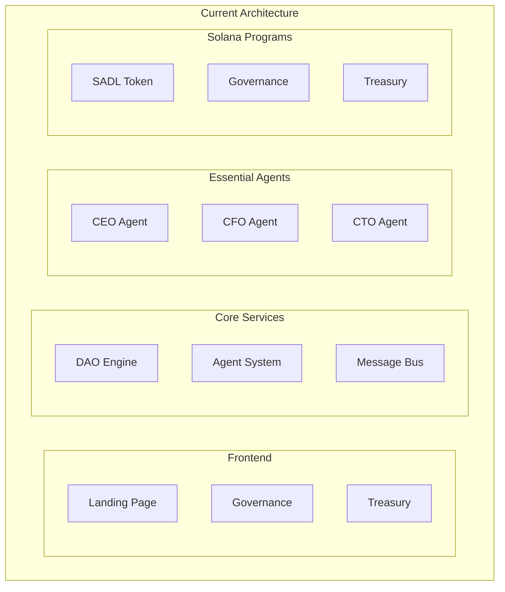

# Complexity Decisions

This document tracks major architectural decisions and complexity trade-offs made during development.

## Current Architecture



## Key Simplifications

### 1. Agent System
BEFORE:
```typescript
// Complex agent hierarchy
interface AgentSystem {
  ceoAgent: CEOAgent;
  cfoAgent: CFOAgent;
  ctoAgent: CTOAgent;
  cooAgent: COOAgent;
  cmoAgent: CMOAgent;
  brandAgents: BrandAgent[];
  analyticsAgents: AnalyticsAgent[];
}
```

AFTER:
```typescript
// Simplified three-agent system
interface AgentSystem {
  ceoAgent: CEOAgent;  // Strategic decisions
  cfoAgent: CFOAgent;  // Financial oversight
  ctoAgent: CTOAgent;  // Technical validation
}
```

### 2. Communication Layer
BEFORE:
```typescript
// Complex microservices
interface Services {
  userService: UserService;
  authService: AuthService;
  notificationService: NotificationService;
  analyticsService: AnalyticsService;
  brandService: BrandService;
  agentService: AgentService;
  governanceService: GovernanceService;
  treasuryService: TreasuryService;
}
```

AFTER:
```typescript
// Unified message bus
interface MessageBus {
  publish(topic: string, message: Message): Promise<void>;
  subscribe(topic: string, handler: MessageHandler): void;
  unsubscribe(topic: string, handler: MessageHandler): void;
}
```

### 3. Smart Contracts
BEFORE:
```solidity
// Complex Ethereum contracts
contract SADLToken is ERC20, Ownable, ReentrancyGuard {
    // Complex vesting logic
    // Multiple token pools
    // Complex governance integration
}
```

AFTER:
```rust
// Simplified Solana program
#[program]
pub mod sadl_token {
    // Core functionality
    // Direct governance integration
    // Simplified distribution
}
```

## Trade-offs Made

### 1. Functionality vs. Simplicity

KEPT:
- Core DAO functionality
- Essential agent capabilities
- Basic treasury management
- Governance features

REMOVED:
- Complex analytics
- Multiple agent roles
- Advanced reporting
- Custom dashboards

### 2. Performance vs. Features

PRIORITIZED:
- Transaction speed
- Decision making time
- System reliability
- Security features

DEFERRED:
- Advanced analytics
- Complex automations
- Custom integrations
- Detailed reporting

### 3. Security vs. Flexibility

PRIORITIZED:
- Core security features
- Access control
- Rate limiting
- Audit logging

SIMPLIFIED:
- Permission system
- Integration points
- Customization options
- External connections

## Implementation Patterns

### 1. Message Handling
```typescript
// Simple message router
class MessageRouter {
  private handlers: Map<string, MessageHandler>;

  async route(message: Message): Promise<void> {
    const handler = this.handlers.get(message.type);
    if (handler) {
      await handler.handle(message);
    }
  }
}
```

### 2. Decision Making
```typescript
// Streamlined decision process
class DecisionEngine {
  async makeDecision(proposal: Proposal): Promise<Decision> {
    const technicalReview = await this.cto.evaluate(proposal);
    const financialReview = await this.cfo.evaluate(proposal);
    
    return this.ceo.decide({
      proposal,
      technicalReview,
      financialReview
    });
  }
}
```

### 3. State Management
```typescript
// Simplified state handling
class StateManager {
  private state: SystemState;

  async updateState(action: Action): Promise<void> {
    await this.validateAction(action);
    await this.applyAction(action);
    await this.notifySubscribers(action);
  }
}
```

## Future Extensibility

### 1. Plugin System
```typescript
// Simple plugin architecture
interface Plugin {
  id: string;
  init(): Promise<void>;
  cleanup(): Promise<void>;
}

class PluginManager {
  private plugins: Map<string, Plugin>;

  async loadPlugin(plugin: Plugin): Promise<void> {
    await plugin.init();
    this.plugins.set(plugin.id, plugin);
  }
}
```

### 2. Feature Flags
```typescript
// Basic feature management
class FeatureManager {
  private features: Map<string, boolean>;

  isEnabled(feature: string): boolean {
    return this.features.get(feature) ?? false;
  }

  async enableFeature(feature: string): Promise<void> {
    await this.validateFeature(feature);
    this.features.set(feature, true);
  }
}
```

### 3. Upgrade Path
```typescript
// Clear upgrade strategy
class UpgradeManager {
  async upgrade(newVersion: string): Promise<void> {
    await this.validateVersion(newVersion);
    await this.backupState();
    await this.applyUpgrade(newVersion);
    await this.verifyUpgrade();
  }
}
```

## Benefits Realized

1. Development Speed
   - Faster iterations
   - Clearer codebase
   - Easier testing
   - Quicker deployments

2. Maintenance
   - Simpler debugging
   - Easier updates
   - Better documentation
   - Clearer ownership

3. Security
   - Fewer attack vectors
   - Better audit coverage
   - Clearer permissions
   - Simplified monitoring

## Lessons Learned

1. Start Simple
   - Begin with core features
   - Add complexity gradually
   - Validate assumptions early
   - Listen to user feedback

2. Focus on Stability
   - Prioritize core functionality
   - Ensure robust testing
   - Monitor performance
   - Plan for failures

3. Plan for Growth
   - Design for extensibility
   - Document decisions
   - Create upgrade paths
   - Maintain flexibility
